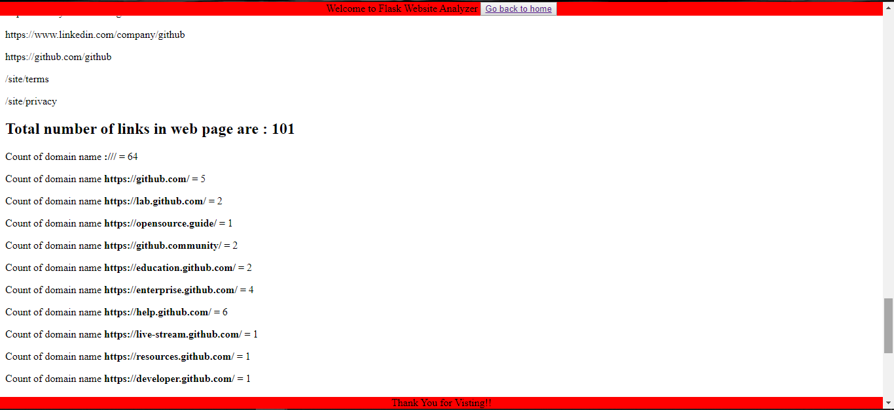

# Domain-Explorer

<strong>Deployed at</strong>: https://domain-explorer.herokuapp.com/ 
<strong> View About it at:</strong> https://prankshaw.github.io/Domain-Explorer/ 
Input any URL and all the links on web-page, types of domains, their count and sizeof web-page will be revealed. 
<strong>Youtube Video:</strong> https://youtu.be/xEHceTdiZSA
## See it Working!
Just download the script(.py) file and run it in your favorite IDE supporting Python 3.x. To download python visit https://www.python.org/downloads/ and then run the script in IDLE (In-built interpreter) or in your choice of IDE.

## Examples

### Screenshot 1

### Screenshot 2

# License
Licensed under MIT-license
https://prankshaw.mit-license.org/

